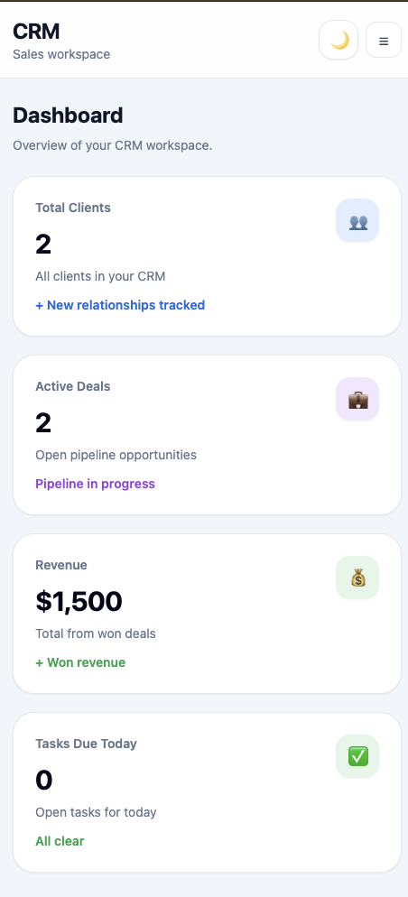

# 🚀 CRM SaaS Platform


Full-stack CRM platform for managing clients, deals, tasks, and sales pipelines.

Built with Next.js, FastAPI, PostgreSQL, and modern SaaS UI patterns.

---

## ✨ Highlights

- Fullstack SaaS CRM platform
- Drag & Drop Kanban pipeline
- Analytics dashboard
- JWT authentication
- Responsive dark/light UI
- Built with Next.js + FastAPI

---

## 🌐 Live Demo

Frontend:
https://crm-self-one.vercel.app

Backend API:
https://crm-b542.onrender.com

---

<p align="center">
  <a href="https://crm-self-one.vercel.app">
    
  </a>
</p>

---

## 🖥 Preview

### Analytics Dashboard


### Kanban Pipeline


---

## ✨ What you can do

- Manage clients and relationships in one place  
- Move deals across pipeline stages with drag & drop  
- Track tasks and deadlines efficiently  
- Store notes and communication history  
- Monitor revenue and business performance via dashboard  

---

## 🚀 Features

### 🔐 Authentication
- JWT authentication (access + refresh tokens)
- Auto logout on expiration
- Protected routes

### 📊 Dashboard
- KPI cards (clients, deals, tasks)
- Revenue overview
- Deals by stage chart
- Recent activity feed
- Skeleton loading

### 💼 Deals (Kanban)
- Drag & Drop Kanban board (Trello-like)
- Stage transitions with API sync
- Pipeline visualization

### ✅ Tasks
- Status filters (open / in progress / done)
- “My Tasks” filter
- Mark as completed

### 👥 Clients
- Full CRUD
- Search & filters
- Manager assignment

### 📝 Notes
- Notes per client
- Search & filtering
- User attribution

---

## 🛠 Tech Stack

### Frontend
- Next.js 16 (App Router)
- React
- TypeScript
- Tailwind CSS
- Axios
- Recharts
- dnd-kit (Drag & Drop)
- Sonner (toasts)

### Backend
- FastAPI
- SQLAlchemy
- PostgreSQL (production)
- SQLite (development)
- JWT Authentication
- Pydantic
- Uvicorn

---

## 💡 Why This Project

This project was built to simulate a real SaaS CRM system used by small teams to:

- manage sales pipelines
- track client interactions
- organize tasks and notes
- visualize business performance

It focuses on **clean architecture, UX, and real-world product logic**.

---

## ⚡ Key Highlights

- 🧩 Fullstack architecture (Next.js + FastAPI)
- 📊 Real-time UI updates with API sync
- 🎯 Drag & Drop Kanban (dnd-kit)
- 🌙 Dark / Light mode
- 📱 Fully responsive UI
- 🔐 JWT authentication system

---

## 🧩 Challenges

- Implemented drag-and-drop pipeline sync with optimistic UI updates
- Built reusable modal system with animated transitions
- Built responsive chart rendering system for Recharts with dynamic sizing
- Designed scalable dashboard card architecture

---

## 📸 Screenshots

### Landing


### Dashboard


### Deals (Kanban Drag & Drop)


### Create Forms


### Mobile UI



---

## ⚙️ Run Locally

### 1. Clone repo

```bash
git clone https://github.com/DariaSyanska/crm.git 
cd crm 
```

---

### 2. Backend

```bash
cd backend 
python3 -m venv .venv 
source .venv/bin/activate 
pip install -r requirements.txt 
uvicorn app.main:app --reload 
```

Backend:
http://127.0.0.1:8000

---

### 3. Frontend

```bash
cd frontend 
npm install 
npm run dev 
```

Frontend:
http://localhost:3000

---

## 🔐 Environment Variables

### Frontend (frontend/.env.local)

```env
NEXT_PUBLIC_API_URL=http://127.0.0.1:8000
```

### Backend (backend/.env)

```env
SECRET_KEY=your-secret-key
DATABASE_URL=sqlite:///./crm.db
```

---

## 📡 API Endpoints (Backend)

### Auth
- POST `/auth/login`
- POST `/auth/register`
- GET `/auth/me`

### Clients
- GET `/clients/`
- POST `/clients/`
- PUT `/clients/{id}`
- DELETE `/clients/{id}`

### Deals
- GET `/deals/`
- PUT `/deals/{id}` - update stage (used for drag & drop)

### Tasks
- GET `/tasks/`
- PATCH `/tasks/{id}/complete`

### Notes
- GET `/notes/`

---

## 👤 Demo Account

Try the demo account:

> Email: admin@example.com  
> Password: 123456

---

## 📁 Project Structure

```bash
crm/
├── backend/
│   ├── app/
│   ├── requirements.txt
│   └── .env
│
├── frontend/
│   ├── src/
│   │   ├── app/
│   │   ├── components/
│   │   ├── lib/
│   │   └── types/
│   ├── package.json
│   └── .env.local
│
└── README.md
```

---

## ✅ Production Build

```bash
cd frontend 
npm run build 
```

---

## 🧠 What This Project Shows

- Full-stack architecture (frontend + backend)
- Real SaaS patterns (dashboard, auth, CRUD)
- Advanced UI (drag & drop, charts, dark mode)
- API integration and state management
- Clean scalable component structure

---

## 🔮 Future Improvements

- Drag & drop reordering inside columns
- Role-based access (admin / manager)
- WebSocket real-time updates
- Notifications system
- Public demo mode
- Team collaboration features
- Activity audit logs
- Advanced analytics dashboard

---

## 🧪 Testing & UX Focus
- Optimistic UI updates
- Empty states
- Loading skeletons
- Responsive mobile experience
- Reusable form architecture
- Accessible contrast & spacing system

---

## 📝 Notes

This project focuses on scalable architecture, UX, and modern SaaS product patterns.

> ⚠️ Backend is hosted on Render and may take ~30 seconds to wake up on first request.

---

## 🙌 Author

Daria Sianska  
Frontend / Fullstack Developer  

- GitHub: https://github.com/DariaSyanska
- Portfolio: https://dariasyanska.github.io/portfolio/
