# 🚀 CRM SaaS (Frontend + Backend)

Full-stack CRM application for managing clients, deals, tasks, and sales pipeline activity.

This project demonstrates a real-world SaaS architecture with authentication, analytics dashboard, drag-and-drop Kanban, and clean UI/UX.

---

## 🌐 Live Demo

- Frontend: https://crm-self-one.vercel.app
- Backend API: https://your-api.onrender.com  

---

## 🚀 Features

### 🔐 Authentication
- JWT authentication (access + refresh tokens)
- Auto logout on expiration
- Protected routes

### 📊 Dashboard
- KPI cards (clients, deals, tasks)
- Revenue overview
- Deals by stage chart
- Recent activity feed
- Skeleton loading

### 💼 Deals (Kanban)
- Drag & Drop Kanban board (Trello-like)
- Stage transitions with API sync
- Pipeline visualization

### ✅ Tasks
- Status filters (open / in progress / done)
- “My Tasks” filter
- Mark as completed

### 👥 Clients
- Full CRUD
- Search & filters
- Manager assignment

### 📝 Notes
- Notes per client
- Search & filtering
- User attribution

### 🎨 UI / UX
- Dark / Light theme toggle
- Responsive SaaS layout
- Empty states
- Toast notifications
- Clean reusable components

---

## 🛠 Tech Stack

### Frontend
- Next.js 16 (App Router)
- React
- TypeScript
- Tailwind CSS
- Axios
- Recharts
- dnd-kit (Drag & Drop)
- Sonner (toasts)

### Backend
- FastAPI
- SQLAlchemy
- PostgreSQL (production)
- SQLite (development)
- JWT Authentication
- Pydantic
- Uvicorn

---

## 📸 Screenshots

### Landing
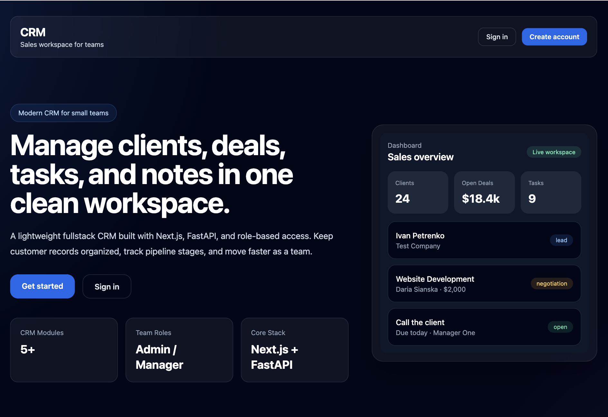
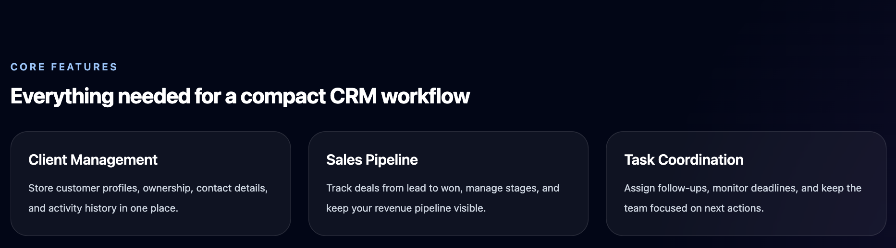

### Dashboard
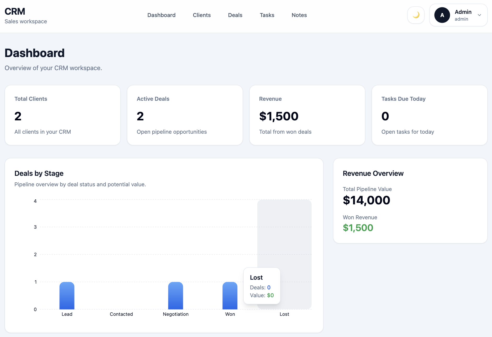
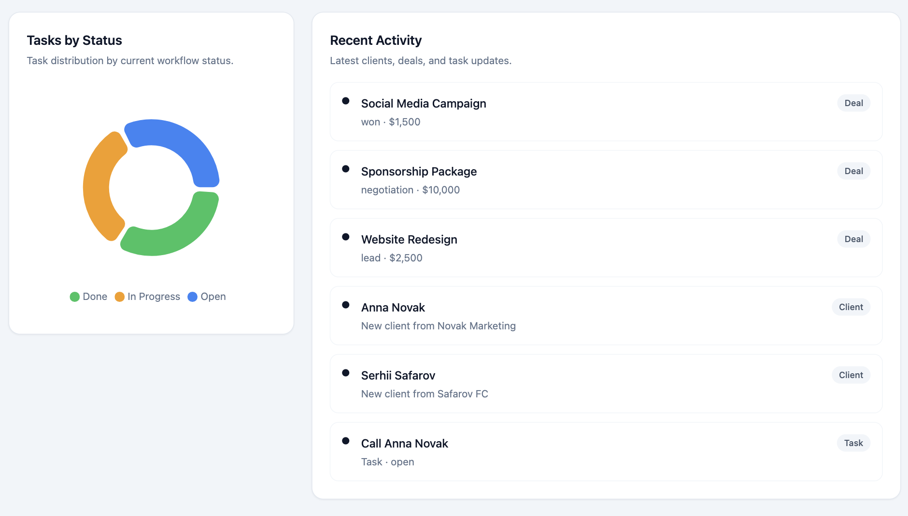
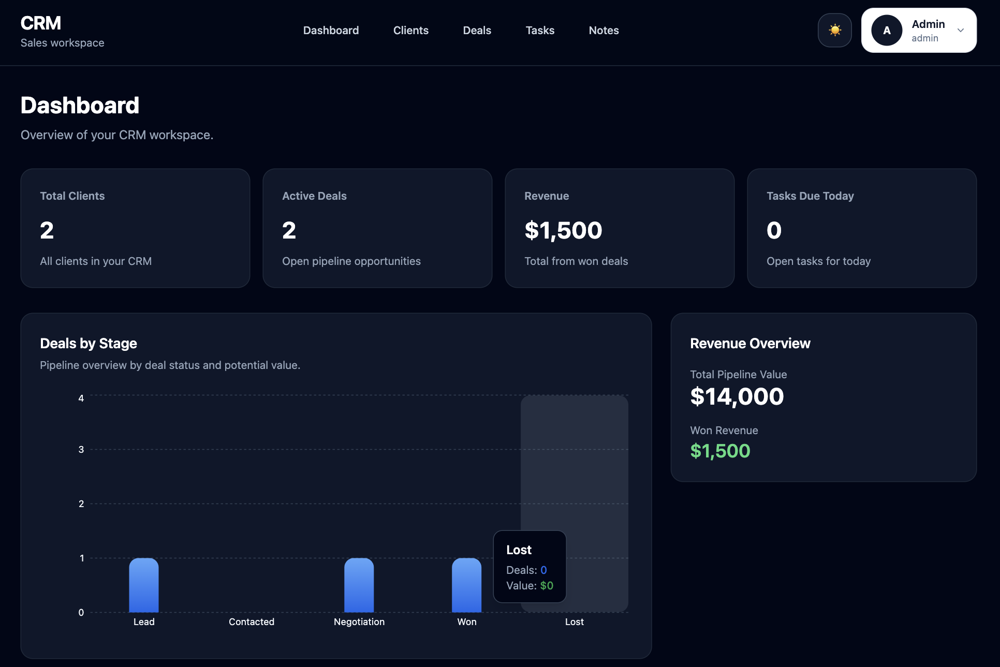
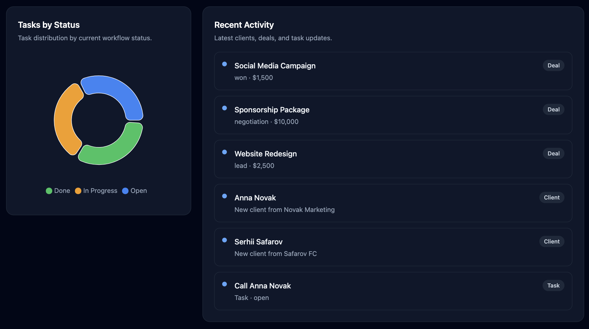

### Deals (Kanban Drag & Drop)
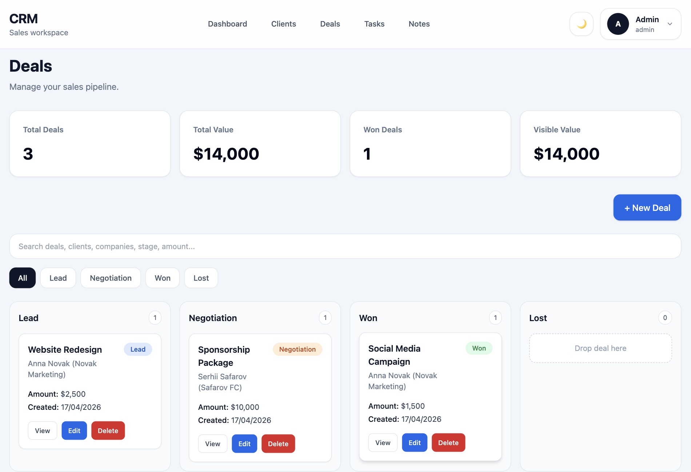
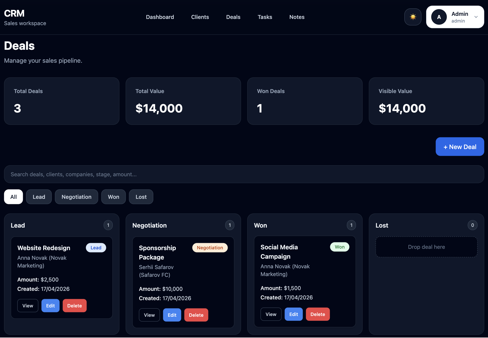

### Clients
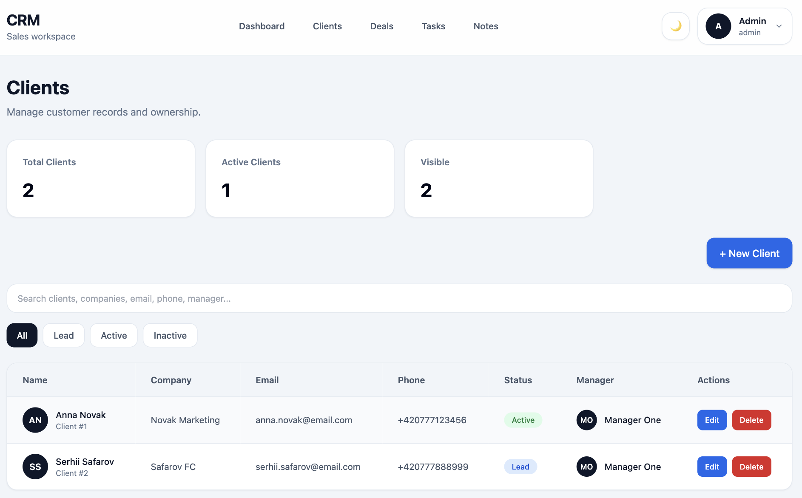
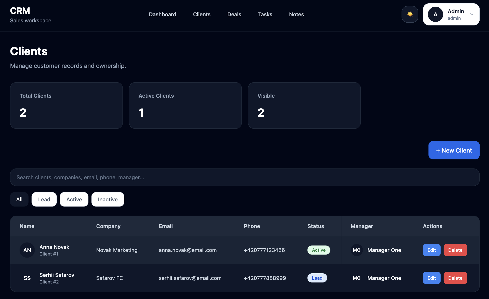

### Tasks
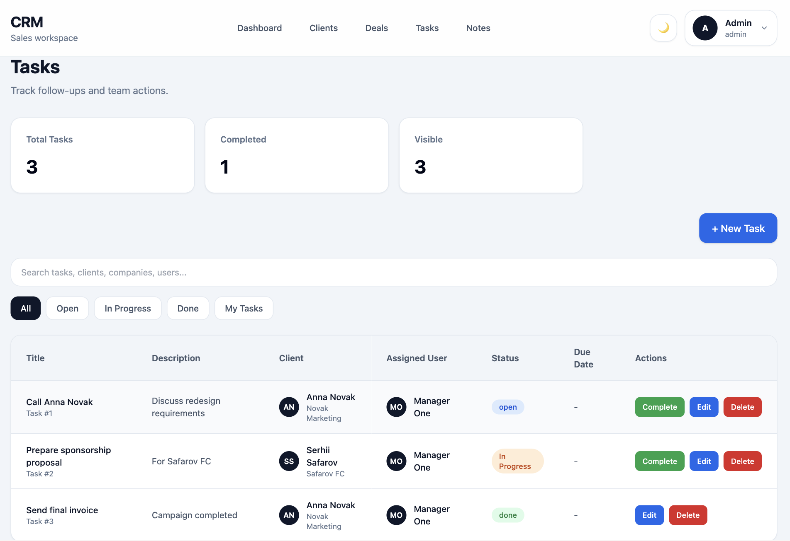
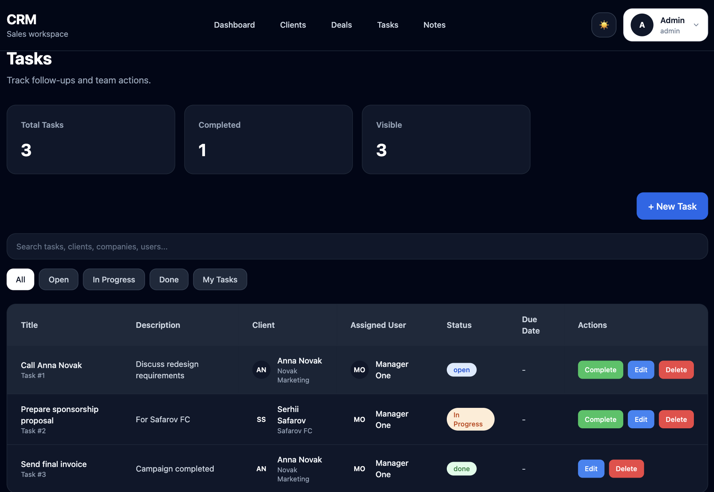

### Notes

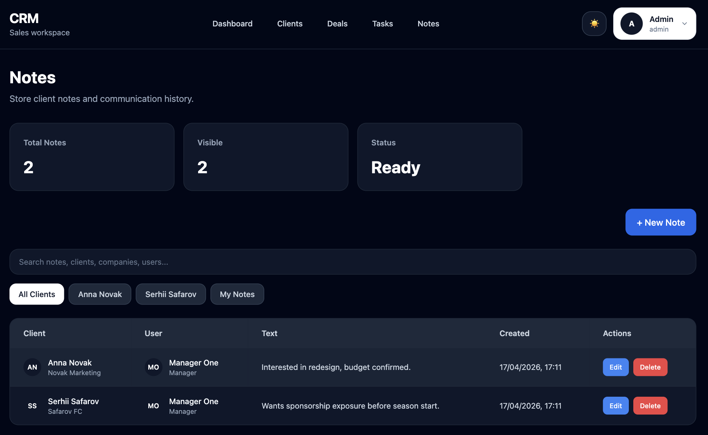

### Create Forms
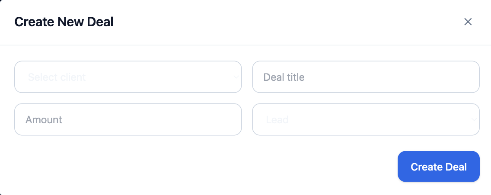
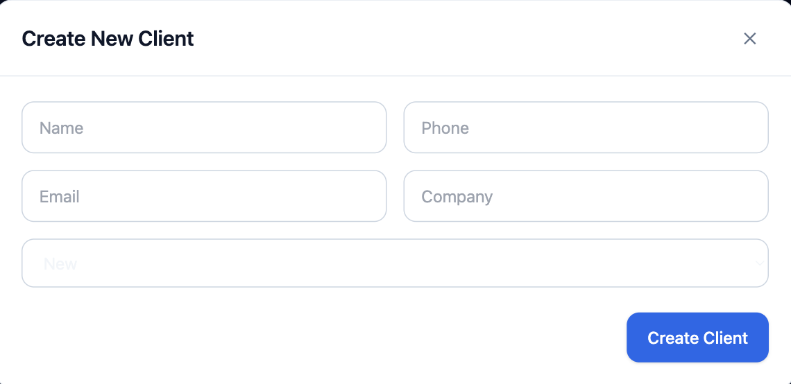
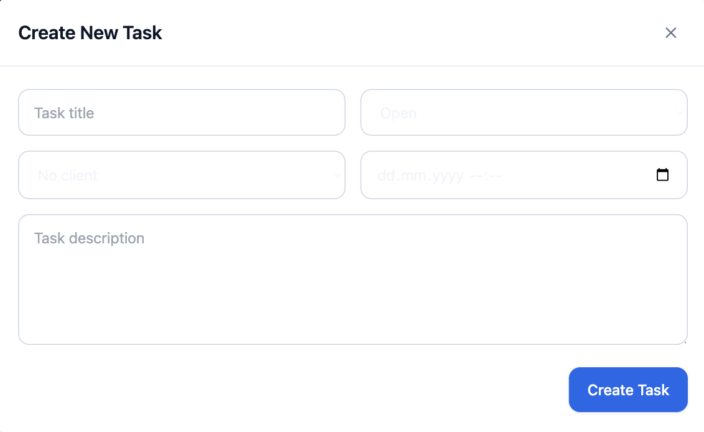
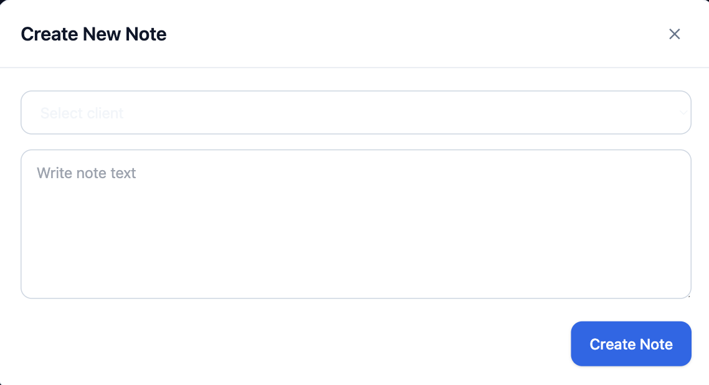

---

## ⚙️ Run Locally

### 1. Clone repo

git clone https://github.com/DariaSyanska/crm.git 
cd crm 

---

### 2. Backend

cd backend 
python3 -m venv .venv 
source .venv/bin/activate 
pip install -r requirements.txt 
uvicorn app.main:app --reload 

Backend:
http://127.0.0.1:8000

---

### 3. Frontend

cd frontend 
npm install 
npm run dev 

Frontend:
http://localhost:3000

---

## 🔐 Environment Variables

### Frontend (frontend/.env.local)

NEXT_PUBLIC_API_URL=http://127.0.0.1:8000 

### Backend (backend/.env)

SECRET_KEY=your-secret-key 
DATABASE_URL=sqlite:///./crm.db 

---

## 📡 API Overview

### Auth
- POST /auth/login
- POST /auth/register
- GET /auth/me

### Clients
- GET /clients/
- POST /clients/
- PUT /clients/{id}
- DELETE /clients/{id}

### Deals
- GET /deals/
- PUT /deals/{id} (used for drag & drop)

### Tasks
- GET /tasks/
- PATCH /tasks/{id}/complete

### Notes
- GET /notes/

---

## 👤 Demo Account

Email: admin@example.com
Password: 123456

---

## 📁 Project Structure

crm/
├── backend/
│   ├── app/
│   ├── requirements.txt
│   └── .env
│
├── frontend/
│   ├── src/
│   │   ├── app/
│   │   ├── components/
│   │   ├── lib/
│   │   └── types/
│   ├── package.json
│   └── .env.local
│
└── README.md

---

## ✅ Production Build

cd frontend 
npm run build 

---

## 🧠 What This Project Shows

- Full-stack architecture (frontend + backend)
- Real SaaS patterns (dashboard, auth, CRUD)
- Advanced UI (drag & drop, charts, dark mode)
- API integration and state management
- Clean scalable component structure

---

## 🔮 Future Improvements

- Drag & drop reordering inside columns
- Role-based access (admin / manager)
- WebSocket real-time updates
- Notifications system
- Public demo mode

---

## 📝 Notes

This project is built for portfolio purposes and is not production-ready without additional security and scaling improvements.
